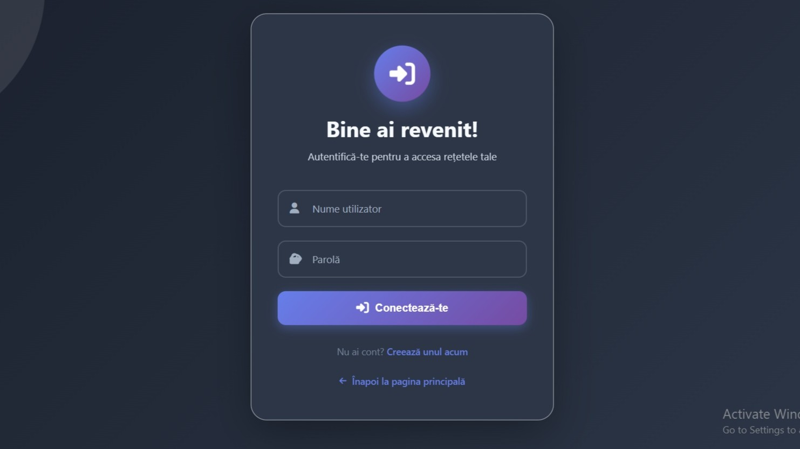
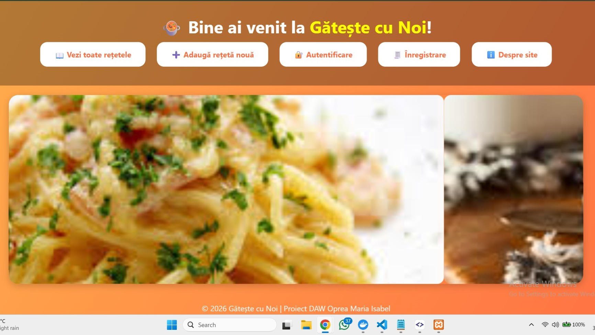
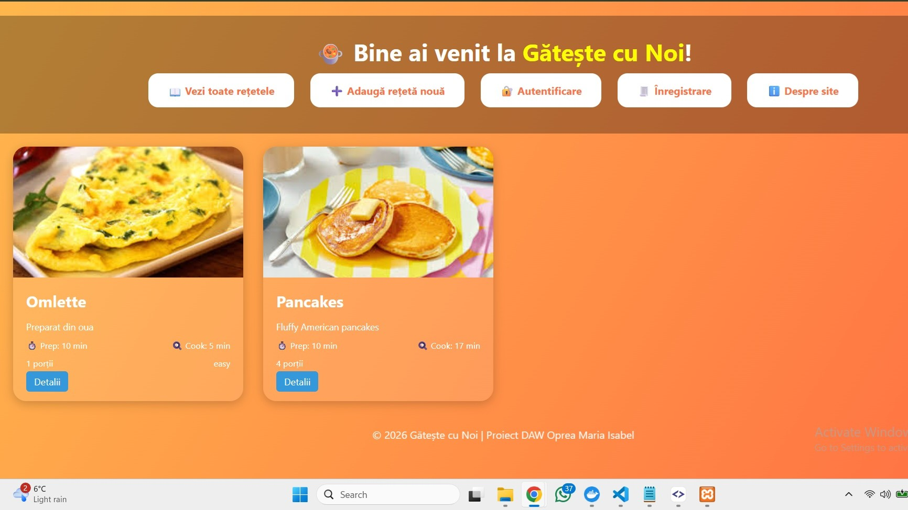

#  Gătește cu Noi - Sistem de Management al Rețetelor

Proiect realizat pentru disciplina DAW (Dezvoltarea Aplicațiilor Web).

##  Caracteristici
* **Autentificare:** Login și înregistrare utilizatori.
* **Catalog:** Vizualizarea rețetelor sub formă de carduri.
* **Detalii:** Ingrediente și mod de preparare detaliat.
* **Operatii CRUD:**Adăugare, vizualizare, editare și ștergere.
* **Testare:** Am implementat si testarea aplicatiei cu PHPUnit

##  Tehnologii Utilizate
* **Backend:** PHP
* **Bază de date:** MySQL
* **Frontend:** HTML5, CSS3
* **Server local:** XAMPP / Apache

## Cum arata proiectul?

### Pagina de Login

### Pagina Principală

### Catalog de Rețete

### Detalii Rețetă (Exemplu Omletă)
.jpg)

---
© 2026 Gătește cu Noi | Proiect realizat de Oprea Maria Isabel
